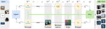

# Robotic Control Stack (RCS)

**RCS**  is a modular toolset designed to streamline the process of setting up and running robotics experiments and simulations. Rather than being a rigid framework, RCS acts as a minimalist, scalable architecture that brings together existing tools into an integrated system with simple, unified interfaces.

## Key Characteristics

- **Unified Simulation and Hardware Interface**  
  Seamless transitions between simulation and physical robot execution, reducing potential obstacles in development and testing cycles.

- **Minimal Dependencies**  
  Lightweight and easy to set up, ensuring high portability across environments.

- **Robot-Agnostic Design**  
  Initially developed for the Franka Research 3 robot, but equipped with abstraction layers to easily support other robot types.

- **Gymnasium-Style API**  
  Offers a familiar and standardized interface for reinforcement learning, promoting ease of integration.

---

## Use Cases of RCS

- **Teleoperation for Data Collection**  
  RCS supports teleoperation to manually control robots and collect expert task demonstrations, which are essential for training robotics foundation models (RFMs).

- **Policy-Based Control**  
  RCS allows robots to be controlled using trained imitation and reinforcement learning policies by providing a modular interface for easy policy switching and remote inference execution.
