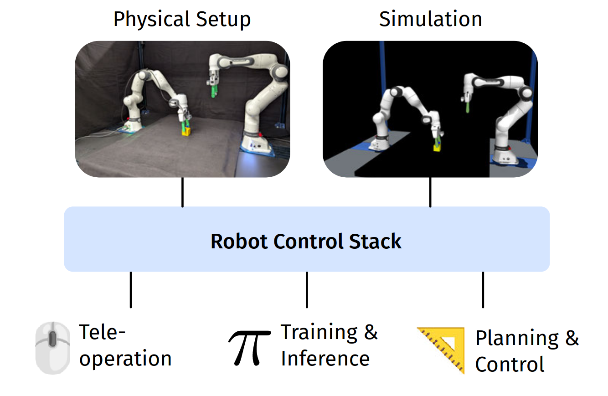

# RCS
```{toctree}
:maxdepth: 2
:caption: Contents:
installation.md
usage.md
development.md
concepts.md
api.md
```
# RCS (Robotic Control Stack)



**RCS (Robotic Control Stack)**  is a modular toolset designed to streamline the process of setting up and running robotics experiments and simulations. Rather than being a rigid framework, RCS acts as a minimalist, scalable architecture that brings together existing tools into an integrated system with simple, unified interfaces.

## Key Characteristics

### Unified Simulation and Hardware Interface
Seamless transitions between simulation and physical robot execution, reducing potential obstacles in development and testing cycles.

### Minimal Dependencies
Lightweight and easy to set up, ensuring high portability across environments.

### Robot-Agnostic Design
Initially developed for the Franka Research 3 robot, but equipped with abstraction layers to easily support other robot types.

### Gymnasium-Style API
Offers a familiar and standardized interface for reinforcement learning, promoting ease of integration.

## Use Cases of RCS

### 1. Teleoperation for Data Collection
RCS supports teleoperation to manually control robots and collect expert task demonstrations, which are essential for training robotics foundation models (RFMs).

### 2. Policy-Based Control with RFMs
RCS allows robots to be controlled using trained AI policies, including those from RFMs, by providing a modular interface for easy policy switching and remote inference execution.

### 3. Modular Inverse Kinematics
The RCS architecture enables users to configure and swap inverse kinematics (IK) algorithms without modifying code, demonstrating the system’s modularity and flexibility.


